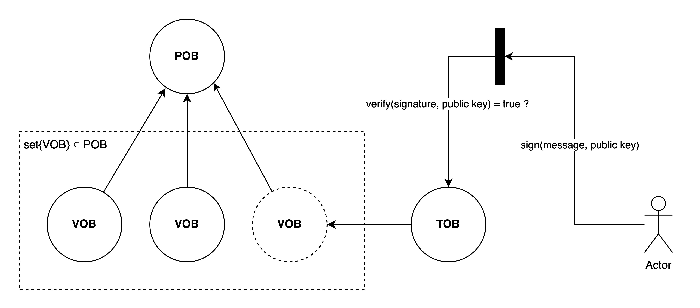

# SciDiscuss - An alternative view to a scientific discussion

**Preliminary**: The proposed approach can be seen as a suggestion for organizing scientific discussions. It draws significant inspiration from the [Polymath project](https://gowers.wordpress.com/2009/01/27/is-massively-collaborative-mathematics-possible/).

## Overview

The mechanics of social networks today enable mass open global communication, ensuring a relative order of discussions and providing convenient viewing options. The structure of discussions within the most popular social networks and forums can be visualized as a tree, where the root of the tree is the initial parent post, and subsequent posts in the discussion inherit from it at successive depth levels. Thus, discussions can evolve into multi-level trees, where each subsequent child element can become the root for further discussions. The obvious drawback of this tree structure for discussions in science is that although logically discussions can separate from the main root of the current discussion structure, they still remain within this structure. An alternative to the tree structure for discussions is proposed: a discussion structure using a directed graph. In this structure, each entity (scientific result) is a node in the graph that can have multiple directed connections to other entities, and itself can receive multiple directed connections. This solution allows each entity to be considered independent, and its numerous outgoing and incoming connections (akin to citations or references) enable more complex analysis of discussions, better reflecting the natural way of communication. More specific proposals will be discussed further.

## Data Structure Design

In the scientific community, any entity, which is currently defined only by a published scientific work, can have many forms. Thus, each type can be a subject of discussion (that is a proposal): an idea, experimental data, a full-fledged study with a hypothesis formulation -- all of which can be presented in the form of text, code, sketches, text and code, or raw data. Additionally, each entity can be supplemented over time, as software on GitHub is expanded or improved versions appear. Therefore, an entity should be considered as an object containing many of its versions, without a defined structure of data expression due to their diversity. It should also be noted that an entity, should be publicly accessible, meaning the entire data structure, including the entities themselves, should be open for public access while ensuring user security. 

## Immutable Public Database

The proposed solution is not accurately termed a database but rather a defined data structure that can be used for a database. However, it will be referred to as a database, implying its unique data structure.

Current requirements for the database include:

1. **Immutability**: Data can only be appended (append-only).
2. **Openness**: Absolute accessibility of data for public use.
3. **Security**: Users can conduct transactions securely, with their transactions being public.
4. **Versioning**: The ability to modify while adhering to an append-only structure.
5. **Interpretability**: Accessibility for convenient exploration of data and relationships between entities.
6. **Scalability**: Independence from a specific format.

Based on the proposal of using a directed graph for structuring discussions, we can propose the following: an immutable public database with a directed graph structure, where each node is an immutable entity -- a Persistent Object (POB). Each POB has directed connections to its versions, known as Versioned Objects (VOB). Adding a new version (VOB) to an entity (POB) is done via a Transaction Object (TOB), containing the author's signature (Author Persistent Object - AOB) in the form of sign(message, public key) using a pair of private and public keys. Upon successful signature verification using public key cryptography: verify(signature, public key), the data is added to the public domain.



Figure 1 - General overview of the interaction process with the database.


Figure 2 - The general view of the data model

### Connections

To ensure both incoming ( to $POB_{origin}$ ) and outgoing connections for content ( from to $POB_{origin}$ ), $VOB-to-many(VOB)$ type connections will be used. The relevance of outgoing connections will be determined by the latest version of the entity - $POB.latest(VOB.connections)$, while the relevance of incoming connections from (foreign) the set of entities $POB_n$ will be verified by the presence of a connection in the latest version (VOB, of foreign) to any of the versions $\set{ VOB \subseteq POB_{origin} }$ such that:
$$Connections = \set{ POB_n.latest(VOB.connections) } \subset POB_{origin}.any(VOB)$$


Figure 3 - Simplified demonstration of connections between objects. POBb.latest(VOB) = VOBver15

$$POB_c.latest(VOB) = VOB_{ver1}$$

$$POB_a, connections = set\set{VOB_{ver15}, VOB_{ver1}}$$

### Persistent Object - POB and Author Object - AOB

A Persistent Object can be viewed as an aggregator of VOB - incoming versions (states) $\set{ VOB \subseteq POB_{origin} }$. POB comes in two types: content POB and author POB (AOB).

An author is also considered a persistent object aggregating their versions, with differences only in connections between objects and the type of POB.id. External connections from other objects will be in the form of $VOB-to-VOB.id$, whereas for authors, only their current state matters. Connections will be directly to their aggregating object rather than to a version: VOB-to-AOB.id, where current data will be taken from the latest version, i.e., AOB.latest(VOB).

**Structure of POB:**

| POB                                                    |
| ------------------------------------------------------ |
| id: POI, string                                        |
| type: enum("post", "problem", "external") enum(string) |
| timestamp: string                                      |

where

- id (POI) - identifier of the object, in Backus-Naur Form, looks like this:
```
<POI> ::= "POI::" <hash_sha-1>
```
  where <hash_sha-1> is the sha-1 hash function of the Request object for creating the current POB with action enum("create");
- type - expected content subtype, types include: enum("post", "external", "problem");
- timestamp - date of creation of the POB in the database;

**Structure of AOB:**

| AOB               |
| ----------------- |
| id: AOI, string   |
| nickname: string  |
| timestamp: string |

where

- id (AOI) - identifier of the object, in Backus-Naur Form, looks like this:
```
<AOI> ::= "AOI::" <public_key>
```
  where <public_key> is the owner's public key from the pair of keys in a public key cryptography system;
- nickname - unique author nickname;
- timestamp - date of creation of the AOB in the database;

### Versioned Object - VOB

A Versioned Object can be viewed as a set of states of a POB, where POB.latest(VOB) is its current state. Each state update must contain a complete set of data required for the full representation of the entity. This means that to access the latest state of an entity, one only needs to refer to its latest version without reviewing numerous previous versions to compare data differences. The VOB object is common to both POB and AOB, with minor differences for each, allowing it to be used without subdivision.

**Structure of VOB:**

| VOB                                                  |
| ---------------------------------------------------- |
| id: VOI, string                                      |
| root: POI or AOI, string                             |
| owners?: array(AOI), array(string)                   |
| connections: array(VOI) or array(AOI), array(string) |
| prev_voi*: VOI, string                               |
| content: any(content object), object                 |
| transaction: TOI, string                             |
| timestamp: string                                    |

where

- \* - additional data that is optional and for optimization purposes only;
- **id** (VOI) - identifier of the object, in Backus-Naur Form, looks like this:
```
<VOI> ::= “VOI::” <hash_sha-1>
```
where <hash_sha-1> is the sha-1 hash function of the Request object for creating the current VOB with action enum("create", "append", "shadow");
- **root** (POI or AOI) - original connection with the parent persistent object;
- **owners**? - necessary for POB, not used in AOB, an array of author identifiers AOI, who according to the latest state POB.latest(VOB) determine the authors who have access to adding a new version;
- **connections** (array(VOI) or array(AOI)) - outgoing connections with external objects, in the case of VOI - connections with content from external objects POB.any(VOB), in the case of AOI - connections with the current state of the author with external objects AOB, which in the current implementation may mean author subscriptions;
- **prev_voi*** - an optimization parameter, a pointer to the previous version of the object POB.latest(VOB), used in the current implementation to allow faster search of all versions and reduce the overall search time for the required version among VOB objects. With action enum("create"), prev_voi is the VOI of the current VOB object;
- **content** (any(content object)) - the main data object of the entity, with a structure that is not strictly defined, allowing for the necessary type as needed;
- **transaction** (TOI) - outgoing connection to the transaction object identifier TOB, which created the VOB object;
- **timestamp** - date of creation of the VOB in the database;

### Transaction Object - TOB

The Transaction Object (TOB) represents a transaction, and upon a successful transaction, it is added to the public database, creating the next Versioned Object (VOB). For a user to initiate a transaction, they must first create a Request object, which specifies the required new state of the object and additional data necessary for processing the transaction. Request object is not recorded to a database itself.

**Structure of Request object:**

| Request object                                           |
| -------------------------------------------------------- |
| tr_type: enum("author", "content"), enum(string)         |
| action: enum("create", "append", "shadow"), enum(string) |
| sig: sign(Sign object, public key), string               |
| owner: AOI, string                                       |
| root?: POI or AOI, string                                |
| type?: enum("post", "problem", "external"), enum(string) |
| connections: array(VOI) or array(AOI), array(string)     |
| prev_voi?* : VOI, string                                 |
| content: any(content object), object                     |

where:

- **tr_type**: The type of transaction, directed at one of the types of persistent objects POB or AOB: enum("content", "author").
- **action**: The action of the transaction, necessary for conducting with the persistent object enum("create", "append", "shadow"). To add a new state, enum("create") is used, for updates - enum("append"), and for deactivating an object, when deletion of data is not used - enum("shadow").
- **sig**: The signature of the new state requested for addition, consisting of the function sign(Sign object, public key).
- **owner**: The actor whose signature is attached to the object, which must correspond to: POB.latest(VOB.owners.consists(AOI)).
- **root**?: The parent persistent object connection. Not necessary for action enum("create"), because the parent element has not been created yet; necessary for action enum("append", "shadow").
- **type**?: The subtype of the content requested for creation, necessary for action enum("create").
- **connections**: Outgoing connections to external objects, in the case of tr_type enum("author") - connections VOB to external objects POB.any(VOB), in the case of tr_type enum("content") - connections to external objects AOB.
- **prev_voi?**: A pointer to the previous version of the object POB.latest(VOB), necessary for action enum("append", "shadow").
- **content**: The main data object of the entity, with a non-strict structure.

For creating a signature in the Request object, and for its subsequent verification, the Sign object is used as the message-to-sign. Its structure is as follows:

**Structure of Sign object:**

| Sign object                                          |
| ---------------------------------------------------- |
| root?: POI or AOI, string                            |
| connections: array(VOI) or array(AOI), array(string) |
| prev_voi?: VOI, string                               |
| content: any(content object), object                 |

where:

- **root?**: A pointer to the parent persistent object, necessary for action enum("append" or "shadow").
- **connections**: Outgoing connections to external objects.
- **prev_voi?**: A pointer to the previous version of VOB, used as a uniqueness guarantee, as signatures cannot be duplicated through the use of a specific POB.latest(VOB) only once. Necessary for action enum("append" or "shadow").
- **content**: The main data object of the entity, with a non-strict structure.

**Structure of TOB:**

| TOB                                                      |
| -------------------------------------------------------- |
| id: TOI, string                                          |
| sig: sign(Sign object, public key), string               |
| tr_type: enum("author", "content"), enum(string)         |
| action: enum("create", "append", "shadow"), enum(string) |
| owner: (AOI) string                                      |
| tr_obj: Sign object, object                              |
| size: string                                             |
| timestamp: string                                        |

where:

- **id**: The identifier of the object, in Backus-Naur Form, looks like this:
```
<TOI> ::= “TOI::” <hash_sha-1>
```
  where <hash_sha-1> is the sha-1 hash function of the Request object for creating the current TOB with action enum("create", "append", "shadow").
- **sig**: The signature of the state from the added Sign object, consisting of the function sign(Sign object, public key).
- **tr_type**: The type of transaction, directed at one of the types of persistent objects POB or AOB: enum("content", "author").
- **action**: The action of the transaction, necessary for conducting with the persistent object enum("create", "append", "shadow"). To add a new state, enum("create") is used, for updates - enum("append"), and for deactivating an object, when deletion of data is not used - enum("shadow").
- **owner**: The actor whose signature is attached to the object, which must correspond to: POB.latest(VOB.owners.consists(AOI)).
- **tr_obj**: The object of the requested new state of data, used in the signature as well.
- **size**: The size of the Request object in bytes.
- **timestamp**: The date of creation of the TOB in the database.

## Signature Method with Public Key

The current database is public and append-only, meaning that an authorized access method for recording by a specific actor needs to be provided while considering the openness of all data. It is proposed to use a cryptographic signature with a key pair - private and public. An algorithm needs to be implemented that allows the author of the signature to sign messages and any other user to verify it without using the author's private key. With all data structures being open, this will enable full transparency, where every transaction and each added or created object can be verified for its signature's correspondence to the owner.

The most popular public key cryptosystems are RSA (Rivest–Shamir–Adleman) and Elliptic-Curve Cryptography (ECC). ECC provides a similar level of security to RSA but with smaller key sizes, making it more efficient in terms of computational resources. However, ECC is much more complex than RSA and potentially has more vulnerabilities, although its security level is higher with a smaller key size.

The elliptic curve method will be used in the current implementation, although this choice is not mandatory.

Thus, the signature will be:

```
Signature = sign(Sign object, private key)
```

Verification will be performed as:

```
Verification = verify(Sign object, Signature)
```

where:

- **Sign object**: The object hashed with the SHA-1 algorithm
- **private key**: The private key obtained from the secp256k1 curve key pair

## Discussion and Proposals

1. In order to provide not only factual but also qualitative relationships between objects and thus propose a way to determine the importance of a particular connection, one can utilize a weighted directed graph structure. Depending on the popularity or contribution of a researcher, connections originating from them to POB or AOB objects will carry more weight compared to other researchers. This approach will enhance the capability for qualitative analysis of relationships and interactions within the open database.

2. The initial requirement for maximum community management has been simplified towards the architecture of the data structure. However, without mechanisms for true decentralization, there will be a significant intermediary in storing and adding transactions. Therefore, it is necessary to consider implementing, akin to blockchain, a process of distributed interaction and consensus in the future. As a proposal, considering the larger volumes of stored information compared to blockchain, involvement of major institutions interested in significant scientific contributions, such as universities, could be sought. Additionally, over time, smaller organizations could be involved, and with advancing technological capabilities, a method for partial distributed storage on users' small devices could be proposed. Each device could store a small portion of the data and exchange it upon connecting to the internet. An algorithm for automatic partitioning based on their required amount could optimize the application, potentially realized as peer-to-peer information exchange. This way, the network could be serviced both by users and large organizations in a decentralized manner.

## Notes on a concept design

The overall concept of the server-side architecture can be envisioned as a three-tier structure. The first tier utilizes an existing DBMS solution, the second tier consists of the core logic algorithms implementing the proposed database architecture, and the third tier overlays basic CRUD logic on these algorithms to simplify access and provide a more understandable interface.


Figure 4 - Process of an Actor Creating a Request to Add or Create Content


Figure 5 - Process of an Actor Creating a Request to Create an Author

Thus, for any operation involving writing to the database, the actor also needs to provide their private key. On the client side, a signature will be generated in the form of `sign(Sign object, private key)`. In this implementation, user authentication is entirely absent since the method of signing with a public key for database entries inherently provides higher security. This is necessary given the initial requirement for the database's public accessibility. While this approach introduces certain inconveniences, it can be mitigated with additional software, such as a blockchain wallet analog, where the user's private keys are stored on the client side. This, however, is a trade-off favoring convenience over maximum security. Therefore, authentication was introduced as a way to preserve user data for convenience.


Screen - Content LinksFrom ver2


Screen - Content LinksTo ver3 (latest)


Screen - Main feed view


Screen - Content edit page. Less fields are required to form a Request object due to a CRUD pattern


Screen - Content create page

## Project setup

Before setting up the project, ensure you have the following:

1. Node.js: Make sure Node.js is installed on your system. You can download it from nodejs.org.
2. MongoDB Community or Cluster: You need MongoDB installed and running locally or have access to a MongoDB cluster. You can download MongoDB Community from mongodb.com.

### Environment Variables

Make sure to set up the following environment variables either in a `.env` file or in your environment:

```plaintext
# to connect to a mongo DB community (locally)
DB_TYPE=local

DB_URL=<example: 127.0.0.1>
DB_PORT=<exmaple: 27017>
DB_NAME=<example: test>
```

If connecting to a cluster instead of a local database, use `MONGO_URI` only in a `.env`.

### Running the Project

1. **Client:**
   ```bash
   cd client
   npm install
   npm run dev
   ```

2. **Server:**
   ```bash
   cd server
   npm install
   npm run dev
   ```

Make sure MongoDB is running locally or configure `MONGO_URI` if connecting to a cluster. Adjust environment variables as necessary for your deployment environment.

### Usage

Once the development server is running, access the application in your web browser at `http://localhost:3000`.

### License

This project is licensed under the [MIT License](LICENSE).
